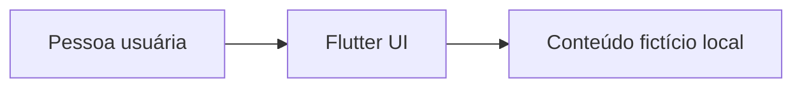
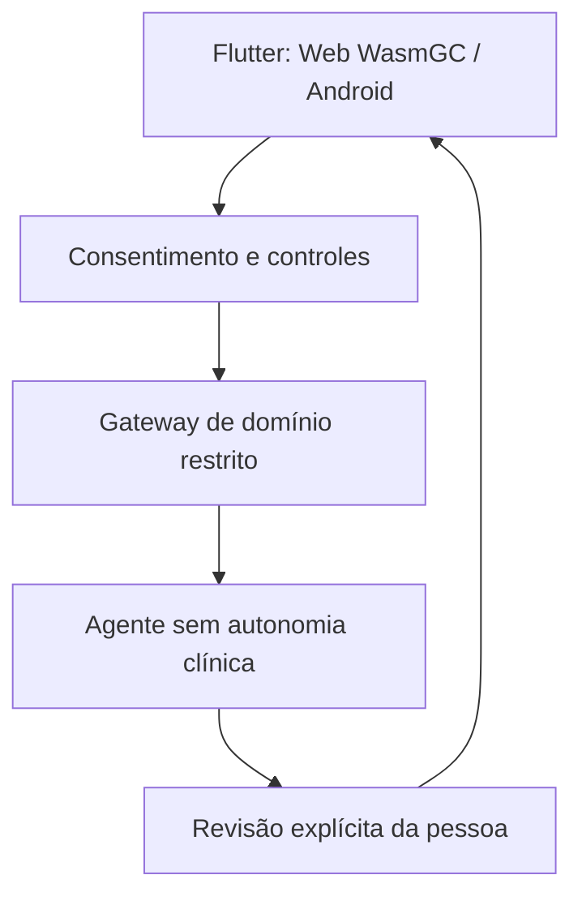

# Arquitetura inicial

## Contexto
A primeira versão é Flutter/Dart, com um app único para Web/WasmGC e Android. O build de demonstração não contém persistência nem comunicação de rede; os exemplos estão codificados como texto fictício.

## Diagrama

Não existe backend, banco, telemetry, autenticação, modelo, agente, conexão com profissional ou ferramenta externa no protótipo.

## Arquitetura futura, sujeita a revisão
Se pesquisa posterior justificar IA, manter cliente Flutter separado de serviço intermediário, com autenticação, autorização, validação de finalidade e orquestração restrita. O modelo não deve acessar dados diretamente nem operar ferramentas: um adaptador explícito aplica allowlist, valida entrada e saída, registra metadados mínimos e requer aprovação da pessoa antes de exportar/compartilhar.

## Restrições de plataforma
- Web: testar build WasmGC nos navegadores realmente suportados; manter fallback JavaScript somente se necessário e documentar diferenças.
- Android: definir minSdk e permissões somente quando uma função real exigir; solicitar nenhuma permissão no demo.
- Não assumir paridade perfeita entre armazenamento, acessibilidade ou rede nas duas plataformas.
