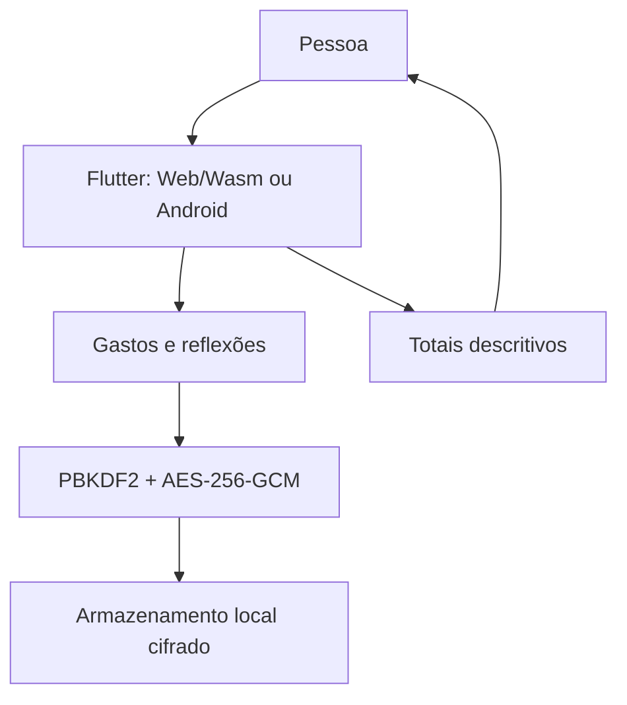

# Arquitetura do MVP

## Visão

Aplicação Flutter client-side para Web/Wasm e Android. GitHub Pages entrega arquivos estáticos; não recebe os registros do diário.

## Modelo de domínio

`ExpenseEntry` guarda id, valor em centavos, data, categoria, situação planejada e texto opcional. Estado emocional, motivação e reflexão são campos livres autodeclarados; o sistema não os infere.

Os resumos somam registros e agrupam pelo estado escrito pela pessoa. São descrições do diário individual, não evidência de correlação populacional ou causalidade.

## Cofre e persistência

- PBKDF2-HMAC-SHA256, 600.000 iterações e salt aleatório de 16 bytes derivam a chave da senha.
- AES-256-GCM cifra o JSON com nonce aleatório novo de 12 bytes por gravação.
- Preferência local guarda somente versão, algoritmo, KDF, salt, nonce, texto cifrado e tag.
- Senha não é persistida; senha esquecida significa perda de acesso.
- Exportação é feita só após ação explícita e resulta em JSON legível.
- Sem backend, telemetria, IA, sincronização ou integração financeira.
- shared_preferences suporta Web/Android, mas descreve a persistência como melhor esforço; exportação serve como cópia manual.

## Limites

A cifra não protege de dispositivo desbloqueado, malware, extensão, navegador ou origem comprometida; código não auditado independentemente. Dados locais podem ser removidos pelo navegador ou pela desinstalação. Isso não representa validação clínica ou conformidade legal.
